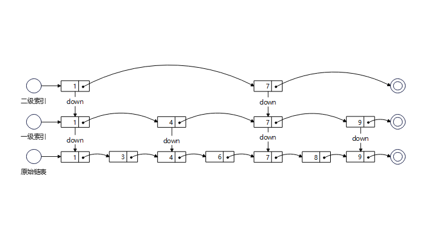
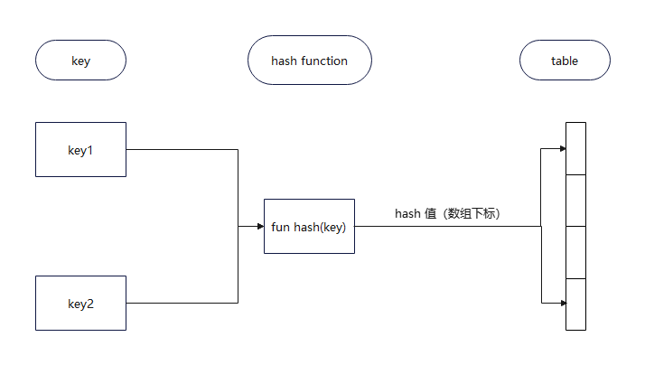
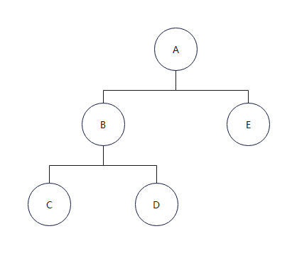
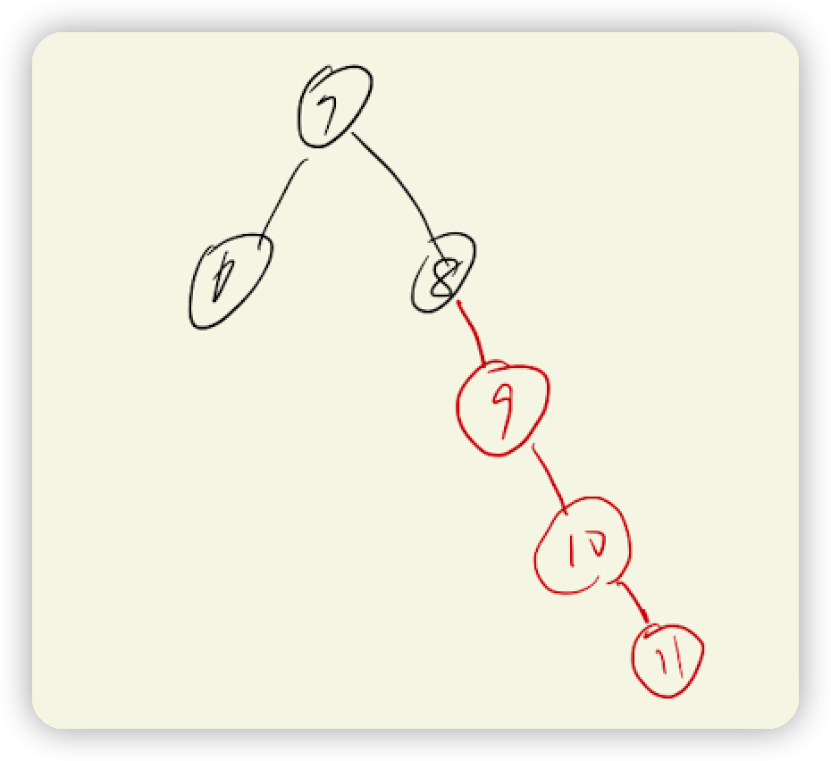
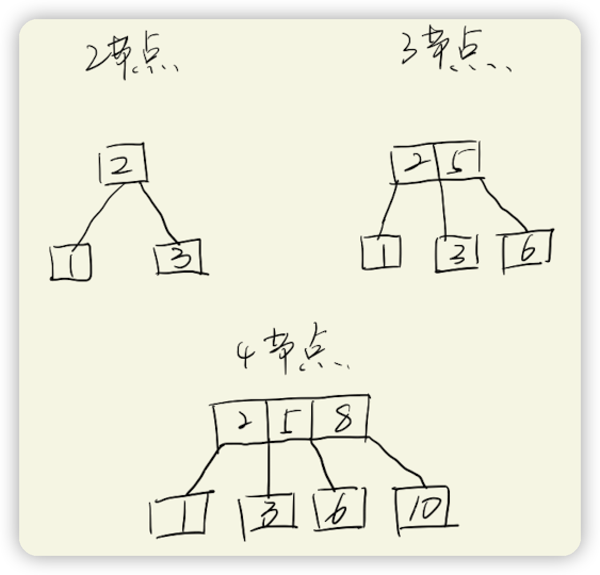
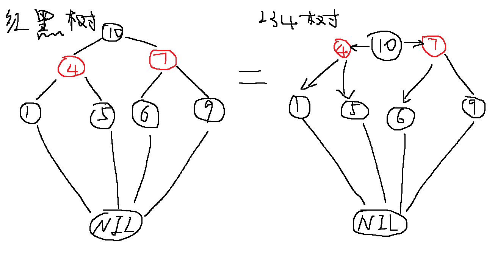
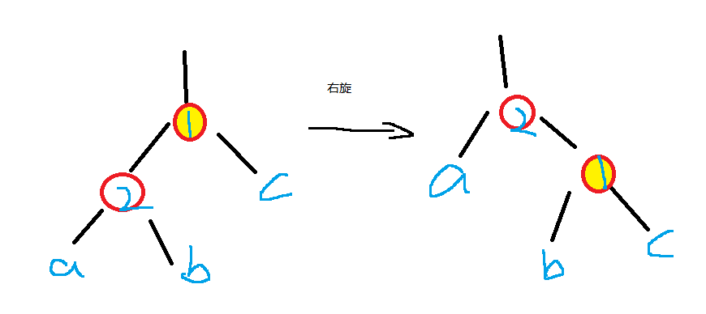

# 数据结构基础

数据结构是一个数据对象，这个对象的实例以及构成该实例的元素都存在着联系，这个联系就是函数。

数据对象就是指一组实例或值。

| 数据类型  | 查询（随机访问） | 插入删除 |
| --------- | ---------------- | -------- |
| 数组/矩阵 | O(1)             | O(n)     |
| 链表      | O(n)             | O(1)     |

## 线性表

线性表分为 顺序表和链表。元素之间可以排成一列，只会存在存在前后关系。相对的非线性表，元素间的关系不仅仅是前后关系，如树、图。

* 顺序表：基于数组实现。
* 链表：基于指针实现。

### 数组和矩阵

数组是一种线性表，具有一片连续的存储空间。

时间复杂度：

* 随机访问：O(1)
* 插入删除：O(n)

优点

- 查询速度快

缺点

- 需要事先设置数组的长度。
- 需要连续的存储空间，且大小固定。
- 插入/删除结点慢。

### 链表

通过指针将一些零散的内存块链接起来，这些内存块叫做链表的结点，结点中包含数据和指针。

链表的第一个结点叫做**头结点**，最后一个结点叫做**尾结点**

时间复杂度：

* 随机访问：O(n)
* 插入删除：O(1)
  * 对于单链表，单纯的插入删除操作虽然是O(1)，但是前驱结点的定位需要O(n)的查询时间，所以实际复杂度是O(n)。双链表优化的就是这点，能直接定位前驱结点。

优点：

- 插入删除速度快。
- 非连续、非顺序的存储结构
- 空间没有限制，也不必事先知道大小。

缺点：
- 随机访问的速度慢。

> 链表的类型：

| 类型     |                                              |                                                              |
| -------- | -------------------------------------------- | ------------------------------------------------------------ |
| 单向链表 | 数据域 + 一个指针域。                        | 一个存储数据元素的数据域 和 一个存储下一个结点地址的指针域（**后继指针**）组成。 |
| 双向链表 | 数据域 + 两个指针域。                        | 在单链表的结果上，增加了一个存储上一个结点地址的指针域（**前驱指针**）。Java的`LinkedHashMap` |
| 循环链表 | 单链表 or 双向链表，**尾结点指针指向头结点** | 能通过任意一个节点找到所有的结点。                           |

### 静态链表

> 使用数组存储的一种链表。基本已经不怎么使用。

数组的每个元素都有**2个数据域**构成，一个存储**数据元素（data）**，一个存储**游标（cur）**,相当于单链表中的next指针。


### 跳表（Skip list）

> 一种`动态数据结构`，核心就是空间换时间，通过**链表 + 多级索引**的方式减少查询次数。
>
> 可以支持类似二分的查找算法，甚至可以替代红黑树（Red-black tree）。
>
> Redis 中的有序集合（Sorted Set）就是用跳表来实现的。

* 链表加多级索引，减少查询次数。
* 支持快速插入、删除、查找操作，时间复杂度为O(logn)。
* 空间复杂度：O(n)，适用于不太在意内存空间的场景。

**结构图：**

> 每两个节点(也可每3个、4个)提取一个节点，建立多级`索引层`，通过`down指针`指向下一级。此时索引层每层最多遍历3次。
>
> 查找时先从索引层开始，依次往下遍历。



跳表索引的动态更新：

> 往跳表中插入数据时，若不更新索引，某2个结点间的数据将很多，甚至退化成单链表。

通过随机函数来维护索引和原始链表大小的平衡。随机生成k, 将结点添加到 `1~k级索引`中。

### 散列表（Hash Table）

> 基于数组支持按照下表随机访问数据的特性扩展而来。
>

* 时间复杂度正常情况O(1)，可能退化为O(n)。
* 散列表大小发生变化时，需要重新调用散列函数计算位置，以及扩容缩容带来性能损耗。
* 不能顺序遍历。

| 概念                     | 说明                                                         |
| ------------------------ | ------------------------------------------------------------ |
| Key                      | 关键字                                                       |
| Value                    | 需要存储的数据                                               |
| 散列函数/hash(key)       | 将Key转换为散列值（数组下标）                                |
| 散列值/Hash 值           | 散列函数计算得到的值                                         |
| 散列冲突                 | 不同的key值经过散列函数计算却得到相同的hash值的情况。        |
| 装载因子（load factor）  | ` 装载因子 = 表中元素个数/散列表的长度`。该值越大，表示数据越多，空位越少，散列冲突可能性将越大，性能损失越大。使用链表法时装载因子可能大于1。 |
| 桶（bucket）/ 槽（slot） | 表示散列表中的一个存储位置。                                 |

存储数据（暂不考虑散列冲突）：输入`key` 和`value`，通过**散列函数**将`Key`映射为数组的下标，然后将数据存储在数组对应的下标中。

查询数据（暂不考虑散列冲突）：输入`key` ，同样通过**散列函数**将`Key`映射为数组的下标，从对应的数组中返回数据。



#### 散列函数

> 设计方法：数据分析法、直接寻址法、平方取中法、折叠法、随机数法等

1. 计算得到一个非负整数（数组下标）。
2. 若key1 == key2，则hash(key1) == hash(key2)。
3. 若key1 != key2，则hash(key1) != hash(key2)。

优化：

可以通过`动态扩容`的方式优化装载因子过大的情况，装载因子过小时也可以通过`动态缩容`的方式优化空间，由于大小发生变化，所以需要重新调用散列函数计算位置。


#### 散列冲突

> 基于鸽巢原理，存在固定n个鸽巢，有n+1只鸽子，那么必然出现2只鸽子在同一个鸽巢里面。
>
> 鸽巢就是哈希值长度，鸽子就是key。哈希算法产生的哈希值长度是固定的，所以可能出现 key1 != key2，而hash(key1) == hash(key2)的情况。
>
> 常用的冲突解决方式有：`开放寻址法`和`链表法`。

**1. 开放寻址法（open addressing）**

出现了散列冲突，就重新探测一个空闲位置，将其插入。

* 所有数据都在数组中，内存是连续的，可以有效地利用 CPU 缓存加快查询速度。
* 序列化方便。
* 大数据量情况下更容易发生冲突：随数据越来越多，冲突将的可能性将递增，空闲位置越来越少，探测时间递增。最坏情况时间复杂度将退化为O(n)，适用于数据量较小的场景。
* 内存利用率低：更加容易发生冲突，装载因子不能设置过大，从而浪费内存空间。

> 线性探测（Linear Probing）：步长 hash(key) + n。
>
> Java 中的 ThreadLocalMap

插入数据：当往散列表中插入数据时，根据`散列值`找到数组对应位置，空闲则存入。若存储位置已被占用，则从当前位置依次往后开始查找，直到找到空闲位置。

查询数据：根据`散列值`找到数组对应位置，比较该位置的key是否匹配，匹配则返回。若不匹配就需要顺序往后依次查询并匹配key，如果遍历到空闲位置也没有找到，表示不在散列表中。

删除操作：由于线性探测的特性，查询时遍历到空闲位置会被认定数据不存在，所以被删除的元素会被`标记为deleted`，而不是直接删除。

> 二次探测（Quadratic probing）

类似线性探测，探测步长不同，步长为` hash(key) + n^2`

> 双重散列（Double hashing）

使用**一组散列函数**，若通过第一个函数得到的位置已被占用，则使用第二个散列函数，依次类推，直到找到空闲位置。

**2. 链表法（chaining）**

> Java 中的 HashMap，底层通过数组+链表+红黑树。
>
> LinkedHashMap

每个槽位对应一个链表。所有散列值相同的元素都放在相同槽位的链表中。

* 适用于大规模数据。
* 内存占用变多。不过对较小对象数据的存储，由于多出了结点指针，可能导致内存消耗翻倍。大对象数据时则可忽略影响。
* 内存不连续，对CPU缓存不友好。
* 需要尽可能让散列值均匀分布，防止时间复杂度退化。

> 散列表碰撞攻击
>
> 恶意的攻击者通过精心构造的数据，使得所有数据在散列函数计算后，都落到相同的槽中。此时散列表退化为链表，查询的时间复杂度变为O(n)，导致查询耗时大大增加，系统可能无法响应其他请求，从而达到拒绝服务攻击（DoS）的目的。
>
> 可以将链表改造为其他数据结构（例如跳表、红黑树等）进行优化，避免退化为O(n)。

#### 散列表的应用

* LRU缓存淘汰策略：散列表 + 双向链表
* Redis有序集合：跳表 + 散列表
* LinkedHashMap：散列表 + 双向链表，原理同LRU缓存淘汰策略。


### 栈

栈是一种 **操作受限的线性表**。具体的实现即可以是数组(顺序栈)，也可以是链表(链式栈)。

* 仅允许一端进行插入(入栈)和删除(出栈)。
* 先进后出，后进先出。

```kotlin
/**
 * 基于数组的顺序栈
 */
class ArrayStack(private val n: Int) {

    private val data = Array<String?>(n) { null }
    private var count = 0

    fun push(item: String): Boolean {
        return when {
            count == n -> false
            else -> {
                data[count++] = item
                true
            }
        }
    }

    fun pop(): String? {
        if (count == 0) return null
        return data[count--]
    }
}
```


### 队列

队列和栈很相似，也是一种操作受限的线性表。具体的实现即可以是数组(顺序队列)，也可以是链表(链式队列)。

* 支持对头删除，队尾插入。
* 先进先出。

| 常见的队列 |                                                              |
| ---------- | ------------------------------------------------------------ |
| 循环队列   | 队列首尾相连，可以优化掉数组队列的数据迁移操作。一般队尾不保存数据，目的是区分队空和队满的情况。 |
| 阻塞队列   | 当队列为空时，从对头获取数据会被阻塞。队列满时，插入数据会被阻塞。使用于生产-消费模式。 |
| 并发队列   | 通过加锁或者CAS，从而支持并发操作的队列。                    |


### 堆

#### 堆排序

在堆排序中会使用完全二叉树。

#### 数组堆化

* 数组的第一个元素`array[0]`不存储数据。
* 堆中的第一个元素就是数组 `array[1]`。

##### 在完全二叉树中父节点和子节点间的快速定位

假设 父节点位置为 i

存在两种情况 序号从 0 开始：

```kotlin
val left = 2 * i + 1
val right = 2 * i + 2
```

序号从 1 开始：

```kotlin
val left = 2 * i
val right = array[2 * i + 1]
```

##### 求完全二叉树最后一个非叶子节点

完全二叉树 长度为 n。

存在两种情况 序号从 0 开始：

```kotlin
val node = n >>> 1 - 1;
```

序号从 1 开始：

```kotlin
val node = n >>> 1;
```

---

## 树（Tree）

> 非线性表，存储方式
>
> 1. 基于指针或者引用的二叉链式存储法。
>
> 2. 基于数组的顺序存储法。

A是BE的**父节点**，BE是A的**子节点**，B和E互为**兄弟节点**。

**根节点**：没有父节点的节点。下图中 A 就是为根节点。

**叶子节点（叶节点）**：没有子节点的节点。下图中CDE就是叶子节点。

**后继节点：**比当前节点大的最小节点。

**前驱节点：**比当前节点小的最大节点。

* **节点的高度：**节点到叶子节点的**最长路径（边数**），例如 heightA = 2；heightB = 1。从上往下递减。
* **节点的深度：**根节点到节点的所经过的边数。depthA = 0；depthB = 1。从上往下递增。
* **节点的层数：**节点深度 + 1。levelA = 1；levelB = 2。从上往下递增。
* **树的高度：**等同 根节点的高度。此处为2。从上往下递减。



### 树的遍历

> 前、中、后是表示当前节点的位置。

* **前序遍历**：对于树中任意节点，先打印这个**节点自身**，再打印**左子树**，最后打印**右子树**。

  ```tex
  [ 根节点, [左子树的前序遍历结果], [右子树的前序遍历结果] ]
  ```

* **中序遍历**：对于树中任意节点，先打印**左子树**，再打印**节点自身**，最后打印**右子树**。

  ```tex
  [ [左子树的中序遍历结果], 根节点, [右子树的中序遍历结果] ]
  ```

* **后序遍历**：对于树中任意节点，先打印**左子树**，再打印**右子树**，最后这个**节点自身**。

  ```tex
  [ [左子树的后序遍历结果], [右子树的后序遍历结果], 根节点 ]
  ```


### 二叉树

>  每个节点**最多两个**子节点：左子节点和右子节点。

### 满二叉树

> 特殊的完全二叉树

* 叶子节点都在最底层。
* 除叶子节点外，都有两个子节点。

### 完全二叉树

* 叶子节点都在最后两层。
* 最后一层所有叶子节点都靠左排列（左对齐、连续）。
* 除最后一层外，其他层节点个数都达到最大。

### 二叉查找树（Binary Search Tree）

> 也叫作`二叉排序树`：由于**左小右大**，使用中序遍历，可以输出有序的数据序列。

特点

- **左子树**上的所有节点的值均**<=父节点**的值。
- **右子树**上的所有节点的值均**>=父节点**的值。
- 左右子树也为满足上述条件的二叉搜索树。

#### 查找

* 首先和根节点比较，如果相等直接返回。

* 若**数据比节点小**，则从**左子树中递归**搜索。

* 若**数据比节点大**，则从**右子树中递归**搜索。

#### 插入

* 执行查找流程

* 若**数据比节点大**且节点的**右子树为空**，则直接将新数据**插入右子节点**位置。若不为空，**则递归遍历右子树**，查找合适位置。
* 若**数据比节点小**且节点的**左子树为空**，则直接将新数据**插入左子节点**位置。若不为空，**则递归遍历左子树**，查找合适位置。

#### 删除

1. 需要删除的节点**没有子节点**：只需要将父节点中原本**指向删除子节点的指针置为null**。
2. **只有一个子节点**：将父节点中原本**指向删除子节点的子节点**。
3. **存在两个子节点：**找到删除子节点右子树中的最小节点，将它的数据替换到删除节点中，再删除这个最小节点。由于是最小节点，至多只有右节点，从原本位置中删除时参考前2条。**实质为 为前/后驱结点的数据交换 + 删除**。此处为后继结点删除。


> 时间复杂度

| 操作 | 最优 | 一般 | 最坏 |
| ---- | ---- | ---- | ---- |
| 查找 |      |      | O(N) |
| 插入 |      |      | O(N) |
| 删除 |      |      | O(N) |

> 查找操作


最坏场景：O(N)

>  插入 9、10、11



>  旋转操作

- 左旋
- 右旋


### 平衡树

> 保证左右子树高度差相对较小，解决在频繁的插入和删除中时间复杂度退化的问题。
>
> 最先被发明的平衡二叉查找树是`AVL 树`。

* 二叉树中任意一个节点的左右子树的高度相差不能大于1。
* 为了维持平衡插入、删除的代价提高。

| 时间复杂度 | 最优 | 一般    | 最坏 |
| ---------- | ---- | ------- | ---- |
| 查找       |      | O(logN) |      |
| 插入       |      | O(logN) |      |
| 删除       |      | O(logN) |      |


### 234树/4阶B树

> 为什么B树常用于存储：
>
> 由于节点之间是不连续的，不同的节点很可能分布在不同的页中，因此当我们查询一个节点时，二叉树来说比对一个节点就需要一次磁盘寻址。而对于B树来说，由于一个节点可以存放多个元素，是一种矮胖型的结构，一次磁盘寻址可以获取多个元素，虽然可能导致比对次数变多，但是降低了磁盘寻址的次数。
>
> 总的来说，寻址次数和树高树对应的，每级需要一次寻址，所以二叉树内存运算次数往往比B树少，但是磁盘寻址次数更多。磁盘寻址的速度却内存运算慢很多。

- B树也是平衡树，和平衡二叉树的确保就是 B树是一种多叉树。其中的4阶B树算是红黑树的前身。
- 节点遵循 左小右大 的原则。
- 4阶B树表示每个节点最多有**3个数据项**和**4个子节点**。

 插入操作：``上溢``。将中间节点作为左右元素的父节点，上移一层。

删除操作：``下溢``。

###  B+树

是一种平衡树，所有的数据都保持在叶子节点中，因此每次查询次数基本相同，查询很稳定。

* **非叶子节点**：**保存索引，不保存数据**。

* **叶子节点**：**保存数据**。
* **叶子节点间增加了相邻叶子节点的指针，形成了一个链表**。结合非叶子节点，有点跳表的意思。
  * 全表扫描就是将所有叶子节点遍历一遍即可，不需要像B树那样逐层扫描。


### 红黑树（Red-Black Tree）

> 一种高效的自平衡二叉查找树。但是并不严格符合平衡二叉树的定义，而是近似平衡。
>
> 每个结点上增加一个存储位表示结点的颜色。
>
> 代码实现中可用一个哨兵代表NIL。

1. 节点是红色或黑色的。
2. 根节点是黑色。
3. 每个叶子节点NIL都是空的， 不存储数据（注意）。
4. 红色节点的父节点和子节点都为黑色(任何相邻的节点都不能同时为红色)。
5. 从任一节点到可达的叶子节点的所有路径都包含相同的数量的黑色节点（黑高相同）。

> 红黑树和234树是等价

- 红黑树的黑色节点个数 = 234树的节点数。（4、10、7是一个节点的三个数据项）
- 234树的每一个节点中：黑色节点必为父节点，红色节点为子节点（黑色在中间，红色在两边）。




#### 树的变换
> 当红黑树平衡被打破时，通过**旋转**和**变色**恢复。
>
> 旋转操作对于二叉查找树来说**一般情况就是为了找到合适的中间值，并重新构建成二叉查找树**。

**变色**：红色节点变为黑色节点，黑色节点变为红色节点。

**左旋（rotate left**）：围绕某个点进行左旋（图中为绕1左旋）。 


**右旋（rotate right）**：围绕某个点进行右旋（图中为绕1右旋）。



#### 插入操作

* 红黑树规定，插入的节点必须是红色。插入红色不会影响黑高，仅需要处理两个红色结点相邻的场景。
* 如果插入的是根节点，直接变色为黑色。
* 其余情况插入的节点``最开始都一定是红色``（出现连续两个红色节点的冲突情况时需要进行旋转和变化）。

> 插入操作的12种情况，可以归纳为3类

- 插入节点的父节点为黑色（4种）：直接插入，不做调整。
- 插入节点的叔父节点不是红色（4种）：变色 + 旋转（单旋、双旋）。
  * LL：变色（父、祖父） + 右旋（绕祖父）。
  * RR：变色（父、祖父）+ 左旋（绕祖父）。
  * RL：变色（插入、祖父） + 父右旋（变为了RR） + 祖父左旋
  * LR：变色（插入、祖父） + 父左旋 （变为了LL）+ 祖父右旋
- 插入节点的叔父节点是红色（4种，对应234树的上溢）：只需要变色。

  1. 父、叔结点：改为黑色（黑高同时 + 1，保证局部平衡）。
2. 祖父结点：改为红色（黑高 - 1，从而保证整体平衡）。

#### 删除操作

* 红色节点直接删除。
* 黑色节点删除。
  * 删除节点有2个红色子节点。（根据前/后驱节点删除，将转化为子节点的删除）
  * 删除节点有1个红色子节点。（需要将子节点染为黑色）
  * 删除节点的子节点为黑色节点。（234的下溢处理）
    * 删除节点为根节点，直接删除。
    * 删除节点的兄弟节点为黑色（**A**）。
      * 兄弟节点有红色子节点。（旋转 + 变换，原理同插入中的LL/RR/LR/RL）
      * 兄弟节点没有红色子节点。（兄弟节点染红，父节点染黑，若父本来就为黑色，则使用父节点作为删除节点递归**A流程**）
    * 删除节点的兄弟节点为红色。（染为黑色后转为上述处理）

### 递归树

> 分析递归算法的时间复杂度

* 将问题拆解为层层子问题
* 计算每一层的总时间
* 统计树高，累加


## 图

邻接矩阵、邻接表、逆邻接表

深度广度优先搜索


## 并查集

### 基础

并查集是一种树型的数据结构，常用于处理一些**不相交集合的合并于查询问题**。

* 合并两个元素所在集合：分别找到两个元素所在根节点，然后将其中一个集合的根节点作为另一个集合的根节点的父节点。
* 查询两个元素是否属于同一个集合：分别查找两个元素的根节点，然后比对根节点是否相同，相同就属于同一个结合。

时间复杂度取决于 树的深度 O(h)。

> 路径压缩进行优化：每次查询时将沿途经过的节点的父节点改为根节点。最好情况下，时间复杂度变为 O(1)

### 带权并查集

两个元素建立连接时，不仅仅是将两个元素所在集合进行合并，而且还需要设置一个权值来表示它们间的关系。

> 带权并查集 进行路径压缩优化时，需要重新计算标注权值。


## 附录

### 伪代码

- 缩进表示块结构。

- `while`、`for`与`repeat-until`等循环结构以及`if-else`等条件语句机构与C、C++、Java、Python和Pascal中的那些机构具有类似的解释。

  ```c++
  to：迭代递增
  downto：迭代递减
  by：指定增量， by 2
  ```

- 符号`//`表示该行后面部分为注释。

- 形如`i=j=e`的多重赋值将表达式e的值赋给变量`i`和`j`。

  ```c++
  j = e;
  i = j;
  ```

- 变量是局部给定过程的。若无显示说明，不使用全局变量。

- 数组元素通过`数组名[下标]`的形式来访问。

  ```c++
  A[i] 表示 数组A的第i个元素。
  .. 表示数组值的一个范围,
  A[1..j] 表示A的一个子数组。
  ```

- 复合数据通常被组织称``对象``,对象又由``属性``组成。

  ```c++
  . 后跟一个 属性名。例如：A.length
  我们把表示一个数组或对象的变量看作指向表示数组或对象的数据的一个指针。
  ```

- ``按值``把参数传递给过程：被调用过程接收其参数自身的副本。

  ```c++
  如果对某个参数赋值，调用过程看不到这种改变。即参数重新赋值对原始参数并没有影响。
  当对象被传递时，指向表示对象数据的指针被复制，而对象的属性并未被复制。即改变对象的属性时，原始对象内的属性也将会被改变。
  数组同对象。
  ```

- 一个`return`语句立即将控制返回到调用过程的调用点。

- 布尔运算符``and``和``or``都是**短路的**。
  x and y，若 x 为 false，则不再求值y。
  x or y，若 x 为 true， 则不再求值y。

- 关键词``error``表示因为已被调用的过程情况不对而出现了一个错误。


### 分析算法

#### RAM模型

假定为单处理器，指令一条接一条地执行，没有并发操作。

- **算术指令**：加法、减法、乘法、除法、其余、向下取整、向上取整

- **数据移动指令**：装入、存储、复制

- **控制指令**：条件与无条件转移、子程序调用与返回

---


