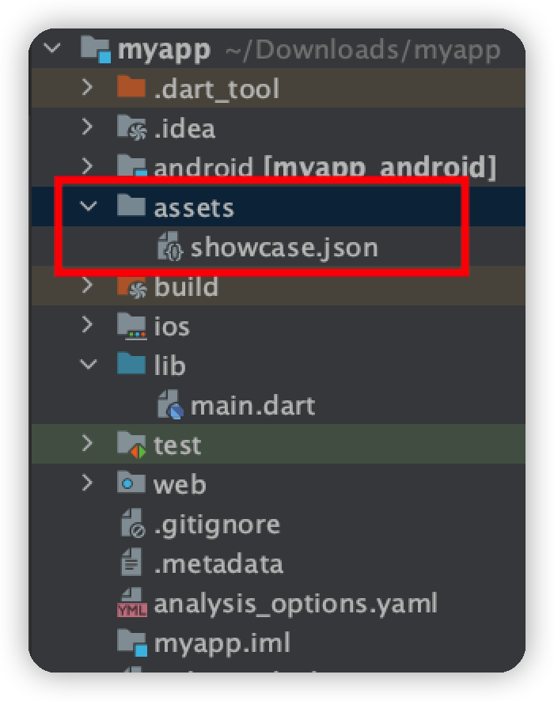
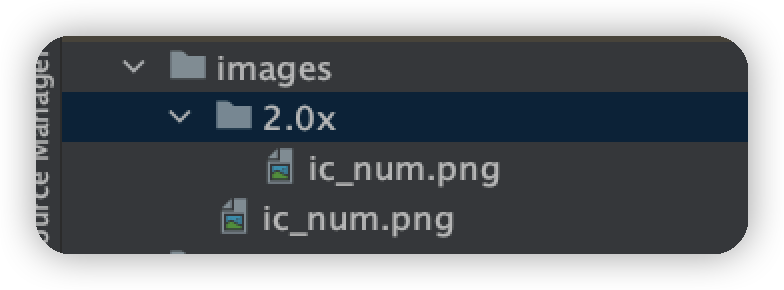

# Flutter项目资源管理

参考资料：

[Flutter 中文开发者网站 | Flutter —— 为所有屏幕构建精美应用](https://flutter.cn/)

[2.6 资源管理 | 《Flutter实战·第二版》 (flutterchina.club)](https://book.flutterchina.club/chapter2/flutter_assets_mgr.html#_2-6-1-指定-assets)

## 项目结构

> Flutter项目中以子项目的方式内嵌了其他平台的项目工程。例如android、ios等。
>
> 子项目中用于实现对应的原生功能。

```txt
myapp
|--- android								- Android子工程。。
|--- build									- Android、IOS等的构建产物。
|--- ios										- IOS子项目。
|--- lib										- Flutter应用源文件目录。
	|--- main.dart						- 程序入口
|--- test										- 单元测试文件目录
|--- web										- Web子项目
|--- myapp.iml							- 工程配置文件
|--- .packages							- 将依赖的包和本地系统中缓存的文件进行映射。
|--- pubspec.lock						- 记录当前项目实际依赖信息的文件，提交此文件可以在多人协作中保证版本一致。
|--- pubspec.yaml						- 管理第三方库以及资源的配置文件
```


## 一、YAML文件一览

Flutter使用`YAML`文件来管理第三方依赖包。

> `pubspec.yaml`

```yaml
name: gallery
description: A resource to help developers evaluate and use Flutter.
repository: https://github.com/flutter/gallery
version: 2.9.3+020903

environment:
  flutter: ^3.1.0-0 # Kept relatively close to master channel version
  sdk: '>=2.17.0 <3.0.0'

# 依赖包配置
dependencies:
  flutter:
    sdk: flutter
  flutter_localizations:
    sdk: flutter
  adaptive_breakpoints: ^0.1.1
  # 依赖包：^版本
  animations: ^2.0.2
  collection: ^1.16.0

dev_dependencies:
  flutter_test:
    sdk: flutter
  flutter_driver:
    sdk: flutter
  args: ^2.3.1
  flutter_lints: ^2.0.1
  grinder: ^0.9.1
  path: ^1.8.1
  string_scanner: ^1.1.0
  test: ^1.21.1
  web_benchmarks: ^0.0.7

flutter:
  deferred-components:
    - name: crane
      libraries:
        # Only one library from the loading unit is necessary.
        - package:gallery/studies/crane/app.dart
      assets:
        - packages/flutter_gallery_assets/crane/destinations/eat_1.jpg
        # ....
	# 资源配置
  assets:
    - packages/flutter_gallery_assets/assets/studies/shrine_card_dark.png
    # ....

  generate: true
  uses-material-design: true
  fonts:
    - family: GalleryIcons
      fonts:
        - asset: packages/flutter_gallery_assets/fonts/GalleryIcons.ttf
```

> YAML字段表

| 字段                | 说明             | 备注                          |
| ----------------- | -------------- | --------------------------- |
| name              | 应用名或包名称        |                             |
| description       | 描述信息           |                             |
| version           | 版本号            |                             |
| dependencies      | 依赖的其他包或者插件     | 参与项目的编译。项目需要依赖某个包时，在此处配置    |
| dev\_dependencies | 开发环境依赖的工具包     | 作用于开发阶段，辅助开发测试使用。比如自动化测试包等。 |
| flutter           | flutter相关的配置选项 |                             |

## 二、Pub包管理

Google官方：[Dart packages (pub.dev)](https://pub.dev/)

***

相关配置位于`pubspec.yaml`中。

```yaml
# 依赖包配置
dependencies:
  #...
  # 依赖包：^版本
  animations: ^2.0.2
```

### 2.1 添加依赖

```shell
flutter pub add 依赖包名
```

也可手动修改`pubspec.yaml`文件：

```yaml
dependencies:
  flutter:
    sdk: flutter
  flutter_localizations:
    sdk: flutter
  adaptive_breakpoints: ^0.1.1
  # 新依赖
  animations: ^2.0.2
  
  # 依赖本地
  pkgxxx:
        path: ../../code/pkgxxx
  # 依赖Git仓库中的包
  pkgxxx:
    git:
      url: git://github.com/dirxx/xxx.git
      # path指定相对位置,若位于根目录则省略 且 xxx = pkgxxx
      path: dirxx/pkgxxx
```

### 2.2 下载依赖

```shell
flutter packages get
```

### 2.3 引入依赖

```dart
import 'package:flutter/material.dart';
```

## 三、资源管理

> Flutter使用`pubspec.yaml`文件来指定资源，使应用程序识别所需的资源。
>
> 资源配置后若不生效，尝试重新编译运行项目。
>
> 使用依赖包中的资源，需要指定包名(package)。

### 3.1 资源配置

指定资源文件：

```yaml
flutter:
  # ...
	# 资源配置
  assets:
  	# assets文件夹在项目根目录下
    - assets/showcase.json
    # 使用flutter_gallery_assets 依赖包下的资源
    - packages/flutter_gallery_assets/assets/studies/shrine_card_dark.png
```



指定资源目录：

> 仅包含当前目录下的所有文件，以及子目录下（与主目录中的文件）的同名文件（请参阅 [Asset 变体](https://flutter.cn/docs/development/ui/assets-and-images#asset-variants)）。如果想要添加子文件夹中的文件，请为每个目录创建一个条目。

```yaml
flutter:
  assets:
  	# 包含指定目录下的所有assets, 目录名称结尾加上 /
    - directory/
    - directory/subdirectory/

```

### 3.2 资源加载

#### 1. 加载文本内容

使用`rootBundle.loadString`读取json中的数据。

```dart
import 'package:flutter/services.dart';
// ....
void _incrementCounter() {
    // ...
    loadFile().then((value) {
      print("loadFile: $value");
    });
  }
// ....
Future<String> loadFile() async {
  return await rootBundle.loadString("assets/showcase.json");
}
```

#### 2. 加载图片

> 多个分辨率图片的存放方式：
>
> 默认1倍：mdpi
>
> 2.0表示2倍：xhdpi
>
> 3.0表示3倍 ：xxhdpi
>
> N.0x



*   yaml中声明

    ```dart
    flutter:
    	assets:
        - images/ic_num.png
    ```

*   加载图片资源

    ```dart
    // 返回ImageProvider, 非widget
    AssetImage('images/ic_num.png');
    // 指定依赖包名
    // AssetImage('images/ic_num.png', package: 'xxx');
    // 返回widget
    Image.asset('images/ic_num.png');
    // 指定依赖包名
    // Image.network('https://xxx.xxx.xxx/xxx', package: 'xxx');
    Image(
      image: AssetImage("images/ic_num.png"),
      width: 100.0
    );
    ```

    *   ImageProvider

        `非widget`, 主要是定义如何获取图片数据的一个辅助类，`AssetImage`实现了如何从Asset中加载图片； `NetworkImage`则是从网络加载图片。

    *   Image

        `widget`，参数`image`指定`ImageProvider`，从而加载图片显示到该组件中。

#### 3. 加载字体

> 字体资源

[Browse Fonts - Google Fonts](https://fonts.google.com/?selected=Material+Icons)

*   yaml中声明

    ```yaml
    flutter:
      fonts:
        - family: Eczar
          fonts:
            - asset: fonts/google_fonts/Eczar-Regular.ttf
            - asset: fonts/google_fonts/Eczar-SemiBold.ttf
              weight: 700
        - family: LibreFranklin
          fonts:
            - asset: fonts/google_fonts/LibreFranklin-Regular.ttf
            - asset: fonts/google_fonts/LibreFranklin-SemiBold.ttf
              weight: 700
    ```

*   使用字体

    ```dart
    const textStyle = TextStyle(
      fontFamily: 'Eczar',
      fontSize: 20,
      color: Color.fromARGB(222, 214, 24, 24));
    var text = const Text(
      "Eczar",
      style: textStyle,
    );
    
    var text2 = const Text(
      "Eczar",
      style: textStyle,
      package: 'xxx', // 使用依赖包中的字体需要指定包名
    );
    ```

#### 4. 字体图标

> 字体图标：将位码对应字形做成了图标。

*   yaml中开启Material Design的字体图标

    ```dart
    flutter:
      uses-material-design: true
    ```

*   字体图标定义

    ```dart
    // 参考Icons
    static const IconData backup = IconData(0xe0c6, fontFamily: 'MaterialIcons');
    // 也仿照进行自定义
    static const IconData a = IconData(0x0001, fontFamily: 'aaa');
    ```

*   使用示例

    ```dart
    // 直接使用
    Icon(Icons.backup);
    // 可以直接用于Text, 需要指定fontFamily：MaterialIcons，即IconData定义时的所属fontFamily。
    String icons = "";
    // Icons.home: 0xe318
    icons += "\ue318";
    Text(
      icons,
      style: TextStyle(
        fontFamily: "MaterialIcons",
      ),
    );
    ```

### 3.3 资源打包

### 3.4 平台共享资源

> Flutter 和 原生之间如何共享资源？

[添加资源和图片 | Flutter 中文文档 | Flutter 中文开发者网站](https://flutter.cn/docs/development/ui/assets-and-images#sharing-assets-with-the-underlying-platform)

### 3.5 平台特定资源

> 一般资源文件都存在多份，对应不同的分辨率。以下仅列举其中一个，其实修改时需要同步修改多份。

#### 1. 应用图标

*   Android

    默认图标位于：`/android/app/src/main/res/mipmap/ic_launcher.png`

    配置文件：`/android/app/src/main/res/AndroidManifest.xml`

    ```xml
     <application
            android:label="myapp"
            android:name="${applicationName}"
            android:icon="@mipmap/ic_launcher">
            ...
    ```

*   IOS

    默认图标位置： `/ios/Runner/Assets.xcassets/AppIcon.appiconset/Icon-App-20x20@1x.png`

#### 2. 启动页

*   Android

    默认背景：`/android/app/src/main/res/drawable/launch_background.xml`

    主题文件：`/android/app/src/main/res/value/styles.xml`

    ```xml
       <style name="LaunchTheme" parent="@android:style/Theme.Light.NoTitleBar">
            <!-- Show a splash screen on the activity. Automatically removed when
                 the Flutter engine draws its first frame -->
            <item name="android:windowBackground">@drawable/launch_background</item>
        </style>
    ```

*   IOS

    默认背景：`/ios/Runner/Assets.xcassets/LaunchImage.imageset/LaunchImage.png`

    配置文件：`/ios/Runner/Assets.xcassets/LaunchImage.imageset/Contents.json`

    ```json
    {
      "images" : [
        {
          "idiom" : "universal",
          "filename" : "LaunchImage.png",
          "scale" : "1x"
        },
        {
          "idiom" : "universal",
          "filename" : "LaunchImage@2x.png",
          "scale" : "2x"
        },
        {
          "idiom" : "universal",
          "filename" : "LaunchImage@3x.png",
          "scale" : "3x"
        }
      ],
      "info" : {
        "version" : 1,
        "author" : "xcode"
      }
    }
    ```
