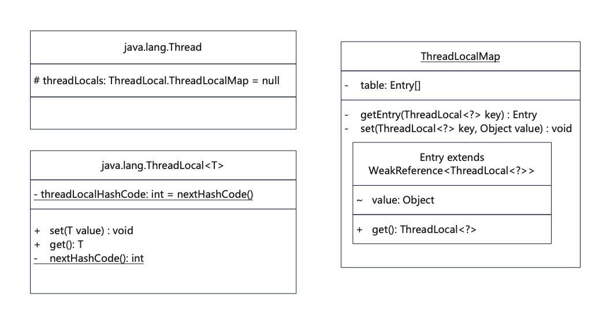

# ThreadLocal

ThreadLocal（线程局部变量） 时 **TLS( 线程局部变量存储空间)** 机制的一种实现，它是**为了方便每个线程处理自己的状态而引入的一个机制**。每个线程都存在一个私有的空间，线程间不共享。

## UML

* 每一个**Thread对象**中都有一个成员变量 ``threadLocals：ThreadLocalMap``。
* ThreadLocalMap 内部包含一个 `ThreadLocalMap.Entity` 数组，用于保存数据。
* `ThreadLocalMap.Entity` 继承自 `WeakReference`。自身是一个 KV 格式。
  * **key**：就是ThreadLocal实例，且为一个弱引用。**起到了一个索引的作用**
  * **value**：是 `ThreadLocal<?>`  范型类型的某个值，是强引用关系。



---

## 源码

ThreadLocal 类是Java提供的实现了 TLS机制的工具类，暴露了一些API供我们操作TLS。

* 保存数据：`ThreadLocal.set(value)` 。
* 获取数据：`ThreadLocal.get()`，不需要参数，因为 ThreadLocal 实例自身就是key。

```java
public class ThreadLocal<T> {
    public T get() {
        // 获取当前线程
        Thread t = Thread.currentThread();
        // 获取 thread 中的 ThreadLocalMap。
        ThreadLocalMap map = getMap(t);
        if (map != null) {
            ThreadLocalMap.Entry e = map.getEntry(this);
            if (e != null)
                return (T)e.value;
        }
        // 这里是第一次初始化的地方
        return setInitialValue();
    }
    
    private T setInitialValue() {
        T value = initialValue();
        Thread t = Thread.currentThread();
        ThreadLocalMap map = getMap(t);
        if (map != null)
            map.set(this, value);
        else
            createMap(t, value);
        return value;
    }
    
    protected T initialValue() {
        return null;
    }
    
    public void set(T value) {
        Thread t = Thread.currentThread();
        ThreadLocalMap map = getMap(t);
        if (map != null)
            map.set(this, value);
        else
            createMap(t, value);
    }
    
    static class ThreadLocalMap {
         // key 是 ThreadLocal 
         // value 是 具体的数据。
        private void set(ThreadLocal<?> key, Object value) {
            Entry[] tab = table;
            // ...
            // 以 Entry的形式保存，是个 kv
            tab[i] = new Entry(key, value);
        }
        ThreadLocalMap getMap(Thread t) {
            return t.threadLocals;
        }

        static class Entry extends WeakReference<ThreadLocal<?>> {
            // 注意这个 value 是强引用
            Object value;
            Entry(ThreadLocal<?> k, Object v) {
                // 这里传入的 key 是弱引用
                super(k);
                // 强
                value = v;
            }
        }
	}
}
```

如何使用，以Looper中的代码 为例：

```java
static final ThreadLocal<Looper> sThreadLocal = new ThreadLocal<Looper>();
private static void prepare(boolean quitAllowed) {
    if (sThreadLocal.get() != null) {
        throw new RuntimeException("Only one Looper may be created per thread");
    }
    // 将looper 保存到 ThreadLocal 中。
    sThreadLocal.set(new Looper(quitAllowed));
}
```

