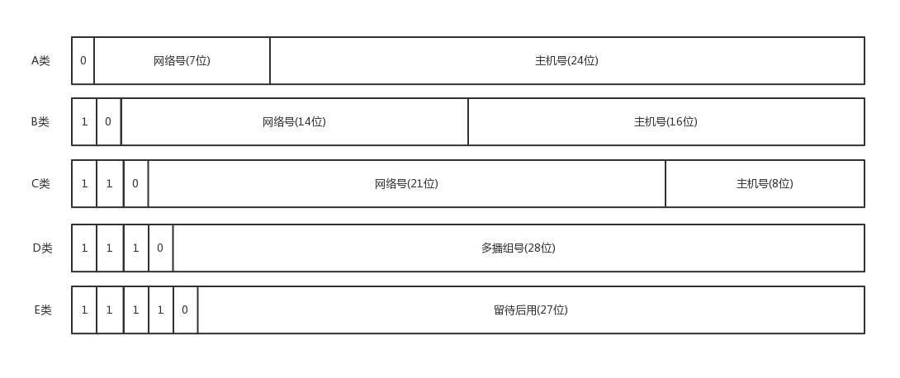

# 网络基础学习梳理

## 网络分层

### TCP/IP 网络分层模型（4层）

| 分层 | 名称                                | 说明                                                         |
| ---- | ----------------------------------- | ------------------------------------------------------------ |
| 四   | 应用层(application layer)           | **Http**                                                     |
| 三   | 传输层（transport layer）           | **TCP和UDP** 协议工作的层次：保证数据在 IP 地址标记的两点之间“可靠”地**传输** |
| 二   | 网际层/网络互连层（internet layer） | **IP 协议**就处在这一层。                                    |
| 一   | 链接层（link layer）/MAC 层         | 负责在以太网、WiFi 这样的**底层网络上发送原始数据包**； 工作在网卡这个层次，使用 MAC 地址来标记网络上的设备。 |

### OSI 网络分层模型（7层）

> 开放式系统互联通信参考模型”（Open System Interconnection Reference Model）

| 分层 | 名称                       | TCP/IP 网络分层模型 | 说明                                              |
| ---- | -------------------------- | ------------------- | ------------------------------------------------- |
| 七   | 应用层(application layer)  | 应用层              | 面向具体的应用传输数据                            |
| 六   | 表示层(presentation layer) | 应用层              | 把数据转换为合适、可理解的语法和语义              |
| 五   | 会话层(session layer)      | 应用层              | 维护网络中的连接状态，即保持会话和同步            |
| 四   | 传输层(transport layer)    | 传输层              | **TCP和UDP**                                      |
| 三   | 网络层(network layer)      | 网际层              | **IP 协议**                                       |
| 二   | 链路层(data link layer)    | 链接层              | 在以太网、WiFi 这样的**底层网络上发送原始数据包** |
| 一   | 物理层(physical layer)     |                     | 电缆、光纤、网卡、集线器等                        |

> `四层负载均衡`：指工作在`传输层`上，基于 TCP/IP 协议的特性，例如 IP 地址、端口号等实现对后端服务器的负载均衡。LVS
>
> `七层负载均衡`：指工作在`应用层`上，解析 HTTP 报文里的 URI、主机名、资源类型等数据，再用适当的策略转发给后端服务器。例如 Nginx

### ARPANER参考模型

- 7：应用层

- 4：传输层

- 3.5：网络层（辅助）

- 3：网络层

- 2.5：链路层（辅助）

## 网络分类

ABC类地址包含的主机范围

- 无类型域间选路（CIDR）

## TCP/UDP

### TCP 

是一个有状态的协议，需要先与对方建立连接然后才能发送数据，而且保证数据不丢失不重复；

数据是连续的“字节流”，有先后顺序；

### UDP

无状态，不用事先建立连接就可以任意发送数据，但不保证数据一定会发到对方；

分散的小数据包，是顺序发，乱序收；

