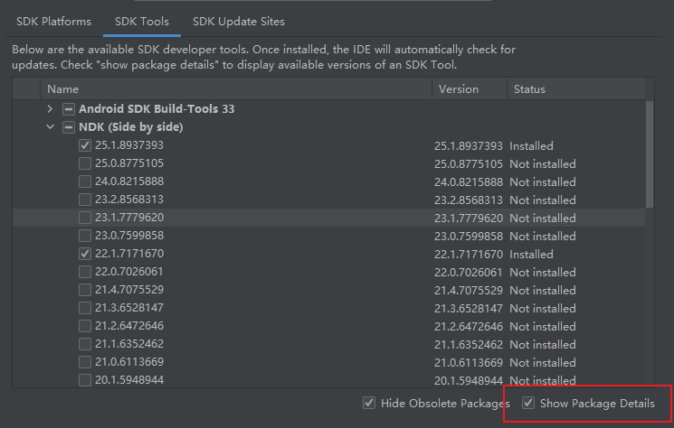
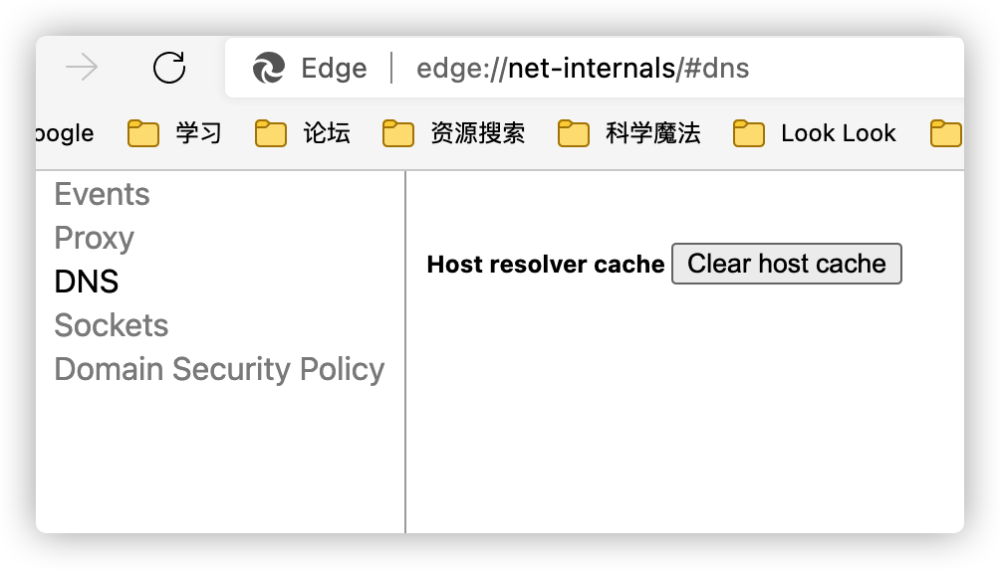
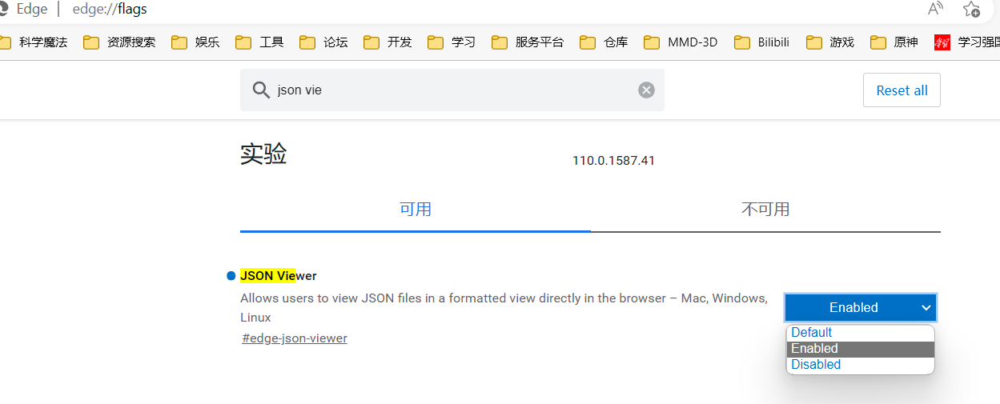

# FAQ


## Android相关

### Android Studio Console控制台乱码

`Help->Edit Custom VM Options`添加以下内容：

```tex
-Dfile.encoding=UTF-8
```


### JavaDoc导出编码错误

> Tools -> Generate JavaDoc

```shell
# Other command line arguments
-encoding utf-8 -charset utf-8
```


### Gradle编译报错：编码GBK的不可映射字符

> 需要`build.gradle`

```groovy
tasks.withType(JavaCompile) {
    options.addStringOption('Xdoclint:none', '-quiet')
    options.encoding = "UTF-8"
}
```

### 

### Gradle升级7.0.2之后发生报错：需要使用java11

> 可以选择Android Studio内置的，也可使用自己下载jdk11


方式一：IDE settings


方式二：gradle.properties添加配置

> 添加jdk11的位置

```properties
org.gradle.java.home=/Library/Java/JavaVirtualMachines/temurin-11.jdk/Contents/Home
```

### Gradle编译错误

---

```groovy
A problem occurred configuring project ':app'.
> Failed to notify project evaluation listener.
   > com.android.build.gradle.tasks.factory.AndroidJavaCompile.setDependencyCacheDir(Ljava/io/File;)V

```

```shell
# 原因
gradle-wrapper.properties和gradle 版本不兼容问题
# 处理方式
# 更新配置到最新
# 使用项目本身的 gradlew 编译
```

报错资源无法找到

```shell
AAPT: error: resource drawable/default_background (aka com.xxxx:drawable/xxxx.xml
```

检查对应的xml文件是否正确, 例如下面 ``<?xml>``标签重复出现了2次

```xml
<?xml version="1.0" encoding="utf-8"?><?xml version="1.0" encoding="utf-8"?>
<layer-list xmlns:android="http://schemas.android.com/apk/res/android">
    .....
</layer-list>
```

---

### Gradle权限：permission denied:

> permission denied: ./gradlew

```shell
 chmod +x gradlew
```

### 依赖库版本冲突

添加一下配置统一版本。

```groovy
android {
configurations.all {
    resolutionStrategy.force "com.android.support:appcompat-v7:$rootProject.supportLibraryVersion"
    resolutionStrategy.force "com.android.support:support-v4:$rootProject.supportLibraryVersion"
    resolutionStrategy.force "com.android.support:support-v13:$rootProject.supportLibraryVersion"
    resolutionStrategy.force "com.android.support:recyclerview-v7:$rootProject.supportLibraryVersion"
    resolutionStrategy.force "com.android.support:support-annotations:$rootProject.supportLibraryVersion"
    resolutionStrategy.force "com.android.support:design:$rootProject.supportLibraryVersion"
}
```

### 旧版本gradle项目运行直接报错

gradle版本：4.6-all等版本

相关错误信息：

```tex
vc-complex-type.2.4.d: 发现了以元素 ‘base-extension‘ 开头的无效内容。此处不应含有子元素
```

升级gradle版本即可(过新的版本需要改动较多):

> gradle-wrapper.properties

```properties
distributionUrl=https\://services.gradle.org/distributions/gradle-6.7.1-bin.zip
```

> build.gradle

```groovy
classpath "com.android.tools.build:gradle:4.2.1"
```


### ClassNotFoundException

```
- 高版本正常运行 低版本报错
- 检查是否分包（multiDexEnabled = true）
若分包了则添加依赖
1. compile 'com.android.support:multidex:1.0.2'
2. 继承MultiDexApplication或者 Application中添加以下代码
@Override
protected void attachBaseContext(Context base) {
    super.attachBaseContext(base);
    MultiDex.install(this);
}
```


### Maven仓库无法更新错误

错误信息:``Using insecure protocols with repositories, without explicit opt-in,``

处理方式：

1. 若支持https，将地址改为https即可。
2. 设置 ``allowInsecureProtocol = true``

```groovy
maven {
  allowInsecureProtocol = true
  url 'http://localhost:8081/repository/maven-public'
}
```

### .9问题

```
..... file failed to compile ...
```

```
# build.gradle  defaultConfig 下添加
aaptOptions.cruncherEnabled=false
aaptOptions.useNewCruncher=false
```

> 还是自己根据原图编辑.9比较靠谱


### java.lang.UnsupportedClassVersionError

保证项目中的JDK和jvm版本一致,此处需要设置为 Java 11

```shell
com/android/tools/idea/gradle/run/OutputBuildAction has been compiled by a more recent version of the Java Runtime (class file version 55.0), this version of the Java Runtime only recognizes class file versions up to 52.0

```


---

### Android Studio如何下载ndk16、低版本cmake等

相关报错：

```shell
Invalid revision: 3.22.1-g37088a8-dirty
```

直接下载NDK：

[最新版本NDK](http://developer.android.com/ndk/downloads/)

[NDK 修订历史记录  | Android NDK  | Android Developers](https://developer.android.com/ndk/downloads/revision_history)

[旧版本NDK](https://github.com/android/ndk/wiki/Unsupported-Downloads)

AndroidStudio下载方式：

勾选`Show Package Details`即可下载旧版本的ndk、cmake。

将高版本的cmake卸载。



配置`local.properties`：

```properties
sdk.dir=C\:\\Users\\35963\\AppData\\Local\\Android\\Sdk
# windows中下载的版本在Sdk\ndk 目录下
ndk.dir=C\:\\Users\\35963\\AppData\\Local\\Android\\Sdk\\ndk\\16.1.4479499
```

新版本 Android Studio 配置 ndk版本的方式发生了变化：

直接在 `build.gradle.kts` 中添加 `android.ndkversion`

```kotlin
android {
    compileSdk = libs.versions.compileSdk.get().toInt()
    defaultConfig {
        minSdk = libs.versions.minSdk.get().toInt()
    }
	//
    ndkVersion = "16.1.4479499"
}
```


### Gradle升级问题：dependencyResolutionManagement

定义 `dependencyResolutionManagement` 后出现 ``gradle Build was configured to prefer settings repositories over project repositories but reposi...`` 报错。

方式一：将 dependencyResolutionManagement 注释去除。

```kotlin
dependencyResolutionManagement {
    repositoriesMode.set(RepositoriesMode.FAIL_ON_PROJECT_REPOS)
    repositories {
        maven {
            isAllowInsecureProtocol = true
            url = uri("http://localhost:8081/repository/maven-public")
        }
        maven { url = uri("https://maven.aliyun.com/repository/public") }
        maven { url = uri("https://maven.aliyun.com/repository/jcenter") }
        maven { url = uri("https://maven.aliyun.com/repository/google") }
        maven { url = uri("https://oss.sonatype.org/content/repositories/snapshots") }
        maven { url = uri("https://jitpack.io") }
        google()
        mavenCentral()
    }
}
```

方式二：`allprojects` 改为 `subprojects`

```kotlin
allprojects {
    repositories {
        // ....
    }
}
```

改为 subprojects：

```groovy
subprojects {
    repositories {
				// ....
    }
}
```


---

## Git：OpenSSL相关报错

```shell
 OpenSSL SSL_read: Connection was aborted, errno 10053
```

关闭验证

```shell
git config http.sslVerify "false"
# 全局
git config --global http.sslVerify "false"

# 内容过大时，需要设置缓冲区大小。
git config --global http.postBuffer 524288000
```


## markdown如何强制换页

```
<div STYLE="page-break-after: always;"></div>
```


## npm修改仓库地址

修改仓库地址

```shell
npm config set registry "https://registry.npm.taobao.org"
```

## CMD在此系统上禁止运行脚本

```
PS C:\WINDOWS\system32> docsify
docsify : 无法加载文件 C:\Users\zaze\AppData\Roaming\npm\docsify.ps1，因为在此系统上禁止运行脚本
```

以管理员权限打开PowerShell，修改执行策略

```shell
## 1
set-ExecutionPolicy RemoteSigned
## 2 根据提示
A
```


## 处理端口占用

1. 查询端口占用的进程

   ```shell
   # 查询占用80端口的进程：LISTENING
   netstat -anp |grep 80
   # windows
   netstat -anp |findstr :80
   ```

2. 结束进程

   ```shell
   kill -9 pid
   # 任务管理器中关闭
   ```

   


## homebrew报错：Error: Another active Homebrew update process is already in progress

处理方式:
```
rm -rf /usr/local/var/homebrew/locks
```

## SQL：unrecognized token: "xxxx"

字符串字段使用时注意增加 单引号。

```sqlite
SELECT * FROM books WHERE url='$url'
```

## python3软连接方式处理python无法运行的问题

```shell
sudo ln -s /usr/local/bin/python3 python
```


## Python：SyntaxError: Non-ASCII character

> python默认编码为ASCII码。在文件开头声明编码即可。

```python
# coding=UTF-8
```

```python
# -*- coding: UTF-8 -*-
```

> 使用python3, Python3.X 默认使用 utf-8编码

```python
#!/usr/bin/python3
```


## CocoaPods错误

error:

```
CDN: trunk URL couldn't be downloaded
```

修改``/etc/hosts``文件

```
199.232.4.133 raw.githubusercontent.com
```


## 虚拟机报错

```tex
不能为虚拟电脑 u22041 打开一个新任务.

Failed to open/create the internal network 'HostInterfaceNetworking-VirtualBox Host-Only Ethernet Adapter' (VERR_INTNET_FLT_IF_NOT_FOUND).

Failed to attach the network LUN (VERR_INTNET_FLT_IF_NOT_FOUND).

返回 代码: E_FAIL
组件: ConsoleWrap
界面: IConsole
```

找到对应虚拟网络**禁用再启用**即可


## C++编译报错 undefined reference

[“undefined reference to“ 解决方法_daijingxin的博客-CSDN博客](https://blog.csdn.net/daijingxin/article/details/117292473#链接的库文件中又使用了另一个库文件)

存在 **c++ 链接 c 编写的a/so库**时出现 `1` 错误，此时头文件处需要添加 `extern "C"`。

```cpp
extern "C" {
#include "./bsdiff/bspatch.h"
#include "./bsdiff/bsdiff.h"
}
```


---

## 浏览器相关清理

### 清理站点数据

> 可以在网络中选择 **Disable cache 禁用缓存**。

- 进入**开发者工具**(F12)
- 选择**应用程序**
- 点击**存储**


### DNS清理

```http
chrome://net-internals/#dns
edge://net-internals/#dns
```




## MacBook相关问题

[如何重置 Mac 的 SMC - Apple 支持 (中国)](https://support.apple.com/zh-cn/HT201295)


## 浏览器如何友好的查看JSON

启用 JSON 查看器，以edge为例。

1. 地址栏输入：`edge://flags`。
2. 搜索 JSON Viewer。
3. 启动后重启浏览器。


