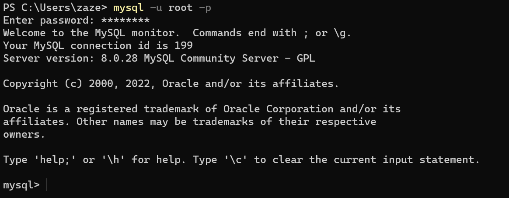

# MySQL

参考文档: [MySQL 教程 | 菜鸟教程 (runoob.com)](https://www.runoob.com/mysql/mysql-tutorial.html)

## MySQL安装

### Windows上安装MySQL

[MySQL Installer for Windows](https://dev.mysql.com/downloads/installer/)

Develop

execute

### 环境配置

用户变量的PATH中添加以下内容:

```
C:\Program Files\MySQL\MySQL Shell 8.0\bin
```

系统变量Path中添加以下内容:

```
C:\Program Files\MySQL\MySQL Server 8.0\bin
```

## 常用命令

```bash
显示数据库 : show databases; 
显示数据表 : show tables; 
显示表结构 : describe 表名; 
创建库: create database 库名; 
删除库: drop database 库名; 
使用库: use 库名; 
创建表：create table 表名 (字段设定列表); 
删除表：drop table 表名; 
修改表：alter table t1 rename t2 
查询表：select * from 表名; 
清空表：delete from 表名; 
```

```bash
创建授权
grant select on 数据库.* to 用户名@登录主机 identified by \"密码\" 
删除授权
revoke select,insert,update,delete om *.* from test2@localhost; 

```

### 连接数据库

| 参数 | 说明                 |
| ---- | -------------------- |
| -h   | 需要登陆的主机地址   |
| -u   | 用户名               |
| -p   | 表示需要使用密码登录 |

```bash
mysql -h主机地址 -u用户名 －p
```



### 断开数据库

```bash
exit
```

### 修改密码

```bash
mysqladmin -u用户名 -p旧密码 password 新密码 
```

### 数据库表修改

```bash
增加列：ALTER TABLE t2 ADD c INT UNSIGNED NOT NULL AUTO_INCREMENT,ADD INDEX (c); 
修改列：ALTER TABLE t2 MODIFY a TINYINT NOT NULL, CHANGE b c CHAR(20); 
删除列：ALTER TABLE t2 DROP COLUMN c; 
```

### 数据库表备份和修复

```bash
备份表: mysqlbinmysqldump -h(ip) -uroot -p(password) databasename tablename > tablename.sql 
恢复表: mysqlbinmysql -h(ip) -uroot -p(password) databasename tablename < tablename.sql（操作前先把原来表删除） 
备份数据库：mysql\bin\mysqldump -h(ip) -uroot -p(password) databasename > database.sql 
恢复数据库：mysql\bin\mysql -h(ip) -uroot -p(password) databasename < database.sql 
复制数据库：mysql\bin\mysqldump --all-databases > all-databases.sql 
修复数据库：mysqlcheck -A -o -uroot -p54safer 
```

### sql文件导入

```bash
文本数据导入： load data local infile \"文件名\" into table 表名; 
数据导入导出：mysql\bin\mysqlimport database tables.txt
```
