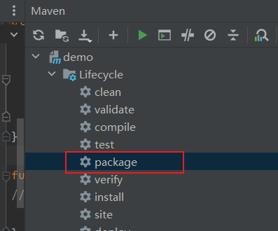

# Spring Boot

快速构建基于Spring的应用程序

[Spring Initializr - 快速构建](https://start.spring.io/)

## 项目结构

* `main`：源码和配置目录。
* `test`：测试用例。
* `target`：项目产物。打包后就在这里面。
* `application.properties` ：项目配置。数据源等。
* `pom.xml`：项目运行所需依赖。
* `DemoApplication.kt`：程序的入口


## 常用注解

### @SpringBootApplication

使用 `@SpringBootApplication` 注解表明程序入口。

```kotlin
@SpringBootApplication
class DemoApplication

fun main(args: Array<String>) {
	runApplication<DemoApplication>(*args)
}

```

### @Primary

存在多个时，作为默认使用。

### @Data

表示数据类。可以省去`getter`、`setter`。

### @Builder

提供一些列辅助类构造的Builder方法

### Bean相关注解

这些注解主要是定义 Bean 和 实例化Bean。

#### @Component

**定义一个通用的Bean**。

没有特殊含义。

#### @Repository

**定义一个数据仓库 Bean**。

负责数据库DAO相关操作。

#### @Service

**定义一个业务服务的Bean**。

负责业务逻辑相关代码。

#### @Controller

**定义一个SpringMVC的 Controller**。

有`@Controller`、 `@RestController` 。


#### @Bean

表示**函数的返回值将作为 Bean**。

```kotlin
@Bean
fun userDataSource(): DataSource {
    return userDataSourceProperties().initializeDataSourceBuilder().build()
}
```

#### 

#### @Autowired

**用于自动实例化Bean**。

`@Component`、`@Repository`、`@Service`、`@Controller` 等注解会将对应类作为Bean交由Spring管理。

用于成员变量时：这个Bean成员变量将会被自动实例化。

用于函数时：注入参数。


#### @Resource

表示这个方法的 **参数需要按照名字来自动注入Bean**。此处注入 `DataSource`。相当于自动调用了 `userDataSource()`。

```kotlin
@Resource
fun userTransactionManager(userDataSource: DataSource): PlatformTransactionManager {
    return DataSourceTransactionManager(userDataSource)
}
```


## 接口定义


## JDBC操作

* 核心接口：core、JdbcTemplate。
* 数据源：datasource。
* 封装JDBC操作类：

### JdbcTemplate

直接传入Sql语句即可。

```kotlin
@Autowired
lateinit var jdbcTemplate: JdbcTemplate
override fun run(vararg args: String?) { 
    // 通用查询，使用RowMapper转换类型，queryForList就是基于这个实现的
    jdbcTemplate.query()
    // 单个查询
    jdbcTemplate.queryForObject()
    // 批量查询
	jdbcTemplate.queryForList()
    // 插入、修改、删除
	jdbcTemplate.update()
    // SimpleJdbcInsert
    // 通用函数
    jdbcTemplate.execute()
    // 批量插入、更新
    jdbcTemplate.batchUpdate()
    // :id, :name 表示引用User对象的对应的成员变量
    NamedParameterJdbcTemplate(dataSource).batchUpdate(
        "INSERT INTO User(id, name) VALUES (:id, :name)",
        SqlParameterSourceUtils.createBatch(list)
    )
}

```


## 数据源配置

### 基本配置方式

> Spring Boot 1.0 默认：Tomcat-jdbc
>
> Spring 2.0 默认：HikariCP

通过`application.properties`配置。

```properties
############################
# 数据源配置，本地开发数据库
spring.datasource.url=jdbc:mysql://localhost:3306/dev?serverTimezone=GMT%2B8&characterEncoding=utf-8
spring.datasource.username=root
spring.datasource.password=123456

# 可选，Spring Boot会根据 url 自动判断类型
# spring.datasource.driver-class-name=com.mysql.cj.jdbc.Driver

# 初始化内嵌数据库
spring.datasource.initialization-mode=embedded|always|never
# 创建初始化
spring.datasource.schema
# 内容初始化，SQL文件
spring.datasource.data
# h2 内存数据库
spring.datasource.platform=h2
############################
############################
```

> 代码：

```kotlin
class DemoApplication : CommandLineRunner {
    @Autowired
    lateinit var dataSource: DataSource

    @Autowired
    lateinit var jdbcTemplate: JdbcTemplate

    val logger: Logger = LoggerFactory.getLogger(DemoApplication.javaClass)

    override fun run(vararg args: String?) {
        logger.info("--------------- start")
        val conn = dataSource.connection
        logger.info(conn.toString())
        conn.close()
        jdbcTemplate.queryForList("SELECT * FROM User")
            .forEach {
                logger.info(it.toString())
            }
        logger.info("--------------- end")
    }
}
```

### 代码自定义替换配置

Spring Boot 通过以下几个类自动进行配置。仅当我们没有配置的类型才会自动补充。

* **DataSourceAutoConfiguration**：配置了 DataSource。
* **DataSourceTransactionManagerAutoConfiguration**：配置了DataSourceTransactionManager。
* **JdbcTemplateAutoConfiguration**：配置了JdbcTemplate

1. 排除Spring的默认实现。

   ```kotlin
   @SpringBootApplication(
       exclude = [DataSourceAutoConfiguration::class,
           DataSourceTransactionManagerAutoConfiguration::class,
           JdbcTemplateAutoConfiguration::class
       ]
   )
   class DemoApplication : CommandLineRunner { ... }
   ```

2. 定义自己的配置实现：`DataSourceProperties`、`DataSource`、`PlatformTransactionManager`

   ```kotlin
   @Bean
   @ConfigurationProperties("user.datasource")
   fun userDataSourceProperties(): DataSourceProperties {
       return DataSourceProperties()
   }
   
   @Bean
   fun userDataSource(): DataSource {
       return userDataSourceProperties().initializeDataSourceBuilder().build()
   }
   
   @Bean
   @Resource
   fun userTransactionManager(userDataSource: DataSource): PlatformTransactionManager {
       return DataSourceTransactionManager(userDataSource)
   }
   ```

### 其他数据源配置（如Druid）

先将默认的连接池依赖排除，再根据 三方连接池的文档进行配置即可。

```xml
<dependency>
    <groupId>org.springframework.boot</groupId>
    <artifactId>spring-boot-starter-jdbc</artifactId>
    <!-- 排除HikariCP -->
    <exclusions>
        <exclusion>
            <groupId>com.zaxxer</groupId>
            <artifactId>HikariCP</artifactId>
        </exclusion>
    </exclusions>
</dependency>
```


## 事务

Spring 提供了 一套 统一事务模型，无论是使用JDBC还是Hibernate抑或是myBatis来访问数据，在Service层的代码都是一样的，提供了一致的操作接口。

### 事务的7种传播特性

| 传播性                       | 值   | 描述                                           |
| ---------------------------- | ---- | ---------------------------------------------- |
| **PROPAGATION_REQUIRED**     | 0    | 默认。当前有事务就⽤当前的，没有就⽤新的       |
| PROPAGATION_SUPPORTS         | 1    | 事务可有可⽆，不是必须的                       |
| PROPAGATION_MANDATORY        | 2    | 当前⼀定要有事务，不然就抛异常                 |
| **PROPAGATION_REQUIRES_NEW** | 3    | ⽆论是否有事务，都起个新的事务，挂起之前的事务 |
| PROPAGATION_NOT_SUPPORTED    | 4    | 不⽀持事务，按⾮事务⽅式运⾏                   |
| PROPAGATION_NEVER            | 5    | 不⽀持事务，如果有事务则抛异常                 |
| **PROPAGATION_NESTED**       | 6    | 当前有事务就在当前事务⾥再起⼀个事务           |

### 事务的隔离特性

| 隔离性                       | 值   | 脏读   | 不可重复读 | 幻读   |
| ---------------------------- | ---- | ------ | ---------- | ------ |
| 默认：以实际使用的数据库为准 | -1   | 数据库 | 数据库     | 数据库 |
| ISOLATION_READ_UNCOMMITTED   | 1    | 允许   | 允许       | 允许   |
| ISOLATION_READ_COMMITTED     | 2    | 禁止   | 允许       | 允许   |
| ISOLATION_REPEATABLE_READ    | 3    | 禁止   | 不允许     | 允许   |
| ISOLATION_SERIALIZABLE       | 4    | 禁止   | 禁止       | 禁止   |

### 编程式事务

主要涉及的类有`TransactionManager`、`PlatformTransactionManager`、`TransactionDefinition`等。

## 项目打包

1. 使用IDE 的Maven操作窗口选择 `package`命令直接打包。

   

2. 在Terminal中执行mvn命令打包，需要配置本地maven环境

   ```shell
   # mvn
   mvn clean package
   ```

打包输出在 `项目/target` 目录中


运行 jar

```shell
java -jar demo-0.0.1-SNAPSHOT.jar
```


